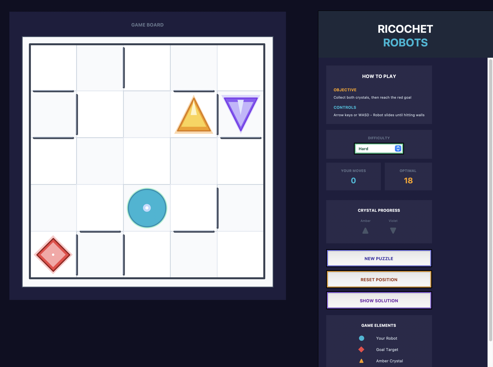

# Ricochet Robots - 5×5 Strategic Sliding Puzzle

**[Play Online](https://edju03.github.io/ricochet-robots/)**

A Python implementation of the classic Ricochet Robots puzzle game with procedural puzzle generation, guaranteed solvability verification, and a modern GUI interface featuring smooth animations and trajectory visualization.

## Quick Start

- **Web Version**: Visit [https://edju03.github.io/ricochet-robots/](https://edju03.github.io/ricochet-robots/)


- **Local Python**: Run `python ricochet_gui_modular.py`


## Overview

Ricochet Robots is a strategic puzzle game where players control a robot that moves like a chess rook - sliding in straight lines until hitting walls or boundaries. The objective is to collect two crystals before reaching the goal, requiring careful planning and understanding of ricochet mechanics.

## Game Rules



## Key Features

- **Puzzle Generator**: Creates new puzzles with guaranteed solvability and adjustable difficulty levels
- **Built-in Solver**: Watch the optimal solution unfold with step-by-step animation showing the shortest path
- **Three Difficulty Levels**: Easy (6-10 moves), Medium (10-14 moves), Hard (14-20 moves)
- **Smooth Animations**: Real-time trajectory visualization showing robot movement paths
- **Reset & Retry**: Return to starting position or generate completely new puzzles instantly

### Core Mechanics
- **Robot Movement**: The robot slides in straight lines (north, south, east, west) until hitting a wall or boundary
- **No Mid-Slide Stopping**: Once movement begins, the robot cannot stop until it encounters an obstacle
- **Grid System**: 5×5 game board with walls positioned between cells (not occupying cell space)
- **Controls**: Arrow keys or WASD for directional movement
- **Trajectory Visualization**: Real-time path display showing robot movement during sliding

### Objectives
1. **Crystal Collection**: Collect both the amber (▲) and violet (▼) crystals in any order
2. **Pass-Through Mechanics**: Crystals are collected when the robot passes through or stops on their positions
3. **Goal Achievement**: Reach the red diamond goal, but only after collecting both crystals
4. **Victory Condition**: Win by sliding through or stopping on the goal with both crystals collected

## Architecture

The codebase is organized into three modular components:

```
├── game_engine.py         # Core game logic and mechanics
├── puzzle_generator.py    # Puzzle creation and verification algorithms  
├── ricochet_gui_modular.py # GUI interface and user interaction
└── test_modules.py        # Automated test suite
```

## Core Algorithms

### 1. Ricochet Movement System (`game_engine.py`)

The ricochet movement algorithm simulates physics-based sliding:

```python
def ricochet_move(self, start_pos: Position, direction: Direction) -> Tuple[Optional[Position], List[Position]]:
    """Returns (final_position, path_taken)"""
    current_pos = start_pos
    path = [start_pos]
    
    while True:
        next_pos = current_pos + direction
        
        # Check boundaries
        if not self.is_valid_position(next_pos):
            return current_pos, path
            
        # Check wall collision
        if self.is_wall_between(current_pos, next_pos):
            return current_pos, path
            
        current_pos = next_pos
        path.append(current_pos)
```

**Key Features:**
- Returns both final position and complete movement path
- Enables pass-through crystal collection mechanics
- Handles boundary and wall collision detection
- Provides path data for trajectory visualization

### 2. EdgeWall System

Walls are represented as connections between adjacent cells rather than occupying cell space:

```python
@dataclass
class EdgeWall:
    from_pos: Position
    to_pos: Position
```

**Advantages:**
- Allows walls on grid boundaries
- More flexible puzzle layouts
- Prevents robots from sliding off the board
- Clean separation of movement space and barriers

### 3. BFS Solvability Verification

The puzzle verification uses breadth-first search with comprehensive state tracking:

```python
def _compute_solution_length(game, max_moves=30):
    # State: (position, collected_items_set, moves)
    queue = deque([(start, frozenset(), 0)])
    visited = set()
    
    while queue:
        pos, collected, moves = queue.popleft()
        
        # Win condition: goal is collected
        if goal in collected:
            return moves
        
        # Try all directions
        for direction in Direction:
            new_pos, path = game.ricochet_move(pos, direction)
            new_collected = set(collected)
            
            # Check collection during slide
            for cell in path[1:]:  # Skip starting position
                if cell == amber_crystal:
                    new_collected.add(amber_crystal)
                elif cell == violet_crystal:
                    new_collected.add(violet_crystal)
                elif cell == goal:
                    # Only allow collecting goal if both crystals are collected
                    if amber_crystal in new_collected and violet_crystal in new_collected:
                        new_collected.add(goal)
            
            queue.append((new_pos, frozenset(new_collected), moves + 1))
    
    return None  # No solution found
```

**Algorithm Properties:**
- **State Space**: (position, collected_items, move_count)
- **Goal Condition**: Goal can only be collected after both crystals
- **Optimality**: Guarantees minimum move count solutions
- **Termination**: Returns `None` for unsolvable puzzles
- **Pass-Through Logic**: Correctly handles crystal collection during movement

### 4. Island-Based Puzzle Generation

Inspired by research on Ricochet Robots puzzle design, the generator uses a structured approach:

#### 2×2 Island Method
```python
def _add_island_walls(game):
    # Define four corner islands
    islands = [
        [(0,0), (0,1), (1,0), (1,1)],  # top-left
        [(0,3), (0,4), (1,3), (1,4)],  # top-right  
        [(3,0), (3,1), (4,0), (4,1)],  # bottom-left
        [(3,3), (3,4), (4,3), (4,4)]   # bottom-right
    ]
    
    # For each island, place L-shaped walls
    for island in islands:
        l_config = random.choice(l_shaped_configurations)
        place_walls(l_config)
```

**Design Principles:**
- Creates forced ricochet points at corners
- Maintains corridors through middle row/column
- Ensures balanced puzzle difficulty
- Prevents trivial straight-line solutions

### 5. Difficulty-Based Generation

The system generates puzzles targeting specific move counts:

```python
difficulty_ranges = {
    'Easy': (6, 10),
    'Medium': (10, 14), 
    'Hard': (14, 20)
}

def generate_strategic_puzzle(game, difficulty='Medium'):
    min_moves, max_moves = difficulty_ranges[difficulty]
    
    for attempt in range(max_attempts):
        setup_random_puzzle()
        moves = _compute_solution_length(game)
        
        if moves and min_moves <= moves <= max_moves:
            return True
    
    return fallback_to_known_layout()
```
## Verification Methods

### 1. Solvability Checking
Every generated puzzle undergoes rigorous verification:
- **BFS Search**: Exhaustive state-space exploration
- **Move Count Validation**: Ensures solutions within difficulty range
- **Reachability Testing**: Verifies all objectives are accessible
- **Dead-End Detection**: Identifies impossible puzzle states
- **Pass-Through Logic**: Validates crystal collection during movement

### 2. Connectivity Analysis
```python
def verify_connectivity():
    # Build adjacency graph of all cells
    # Use DFS to ensure start, crystals, and goal are connected
    # Reject puzzles with isolated components
```

### 3. Quality Metrics
- **Solution Length**: Target specific move count ranges
- **Branching Factor**: Average decision points per move
- **Multiple Solutions**: Detection of redundant solution paths
- **Forced Sequences**: Identification of unique move requirements

### 4. Fallback System
If procedural generation fails:
```python
def generate_guaranteed_solvable_puzzle():
    for attempt in range(max_attempts):
        if generate_strategic_puzzle():
            return True
    
    # Fallback to hand-designed layouts
    return generate_original_strategic_puzzle()
```

## Performance Optimizations

### 1. State Space Pruning
- **Visited State Tracking**: Prevents redundant explorations
- **Move Limit Bounds**: Caps search depth for efficiency  
- **Early Termination**: Stops on first optimal solution found

### 2. Memory Management
- **Frozenset Collections**: Immutable state representations
- **Position Hashing**: Efficient state comparisons
- **Path Compression**: Minimal memory for movement tracking

### 3. Algorithm Complexity
- **Time Complexity**: O(4^d × |states|) where d = max depth
- **Space Complexity**: O(|reachable_states|)
- **Typical Performance**: Sub-second generation for 5×5 grids

## Testing Framework

### Automated Test Suite (`test_modules.py`)
```python
def test_game_engine():
    # Verify core mechanics
    # Test position arithmetic
    # Validate wall collision detection

def test_puzzle_generator():
    # Check solvability verification
    # Test difficulty range compliance
    # Verify fallback mechanisms

def test_game_mechanics():
    # Validate robot movement
    # Test crystal collection
    # Verify win conditions
```

### Test Coverage
- **Core Mechanics**: Robot movement, collision detection, crystal collection
- **Puzzle Generation**: Solvability verification, difficulty targeting
- **GUI Components**: Animation systems, user input handling
- **Edge Cases**: Boundary conditions, impossible states

## Installation & Usage

### Requirements
- Python 3.7+
- tkinter (usually included with Python)
- No additional dependencies required

### Running the Game
```bash
python ricochet_gui_modular.py
```

### Running Tests
```bash
python test_modules.py
```

### Controls
- **Arrow Keys** or **WASD**: Move robot in cardinal directions
- **NEW PUZZLE**: Generate a new puzzle with current difficulty
- **RESET POSITION**: Return robot to starting position
- **SHOW SOLUTION**: Demonstrate optimal solution path
- **DIFFICULTY**: Select Easy/Medium/Hard puzzle complexity
